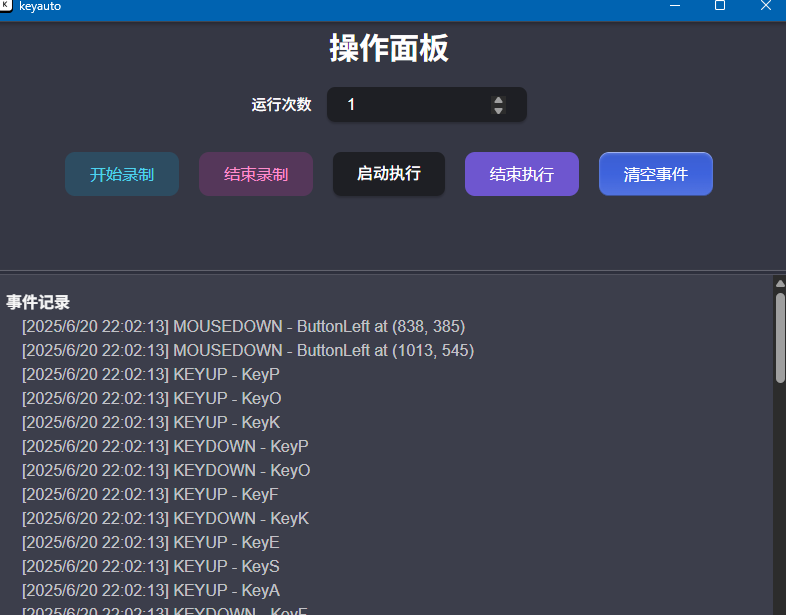

# keyauto

#### 介绍
🐦‍🔥🦀基于tauri的PC端键鼠事件模拟,类似按键精灵 ( React+Radix+Zustand+RDev+Enigo+Rust) 


## 示例



## 快速开始
- 开始录制事件 , 然后结束录制
- 完成之后点击启动执行


## 源码构建
```shell
pnpm i 
pnpm td 
```


